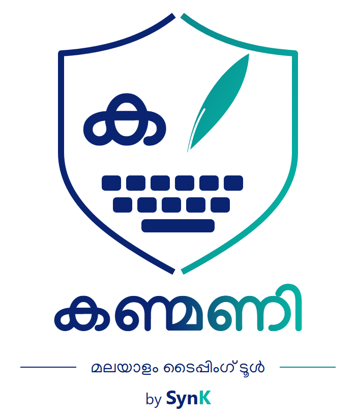

<p align="center">
  
</p>

<h1 align="center">Kanmani — Type Manglish, Get Malayalam Everywhere</h1>

<p align="center">
  Malayalam system-wide transliteration for Windows.<br>
  Type in English letters in <b>any app</b> and get Malayalam instantly.
</p>

<p align="center">
  <a href="https://github.com/SynK-Soft/synk-free-apps/raw/refs/heads/main/Versions/1_0_0/Kanmani.exe"><b>⬇ Download Kanmani v1.0.0 for Windows (EXE)</b></a><br>
  <sub>Free • Portable • No install • Windows 10 / 11</sub>
</p>

---

## What is this repo?

**SynK Free Apps** is where SynK publishes free, ready-to-use Windows tools.

Right now this repo contains one app:

| App | What it does | Download |
|-----|--------------|----------|
| **Kanmani v1.0.0** | Type Manglish anywhere → get Malayalam | [Kanmani.exe](Versions/1_0_0/Kanmani.exe) |

> Just want Kanmani? Click the download link above and skip to [How to use](#-how-to-use-daily-use).

---

## What is Kanmani?

Kanmani lets you type Malayalam without a Malayalam keyboard.

You keep your keyboard in English (US) and type phonetically (Manglish). Kanmani converts it live to Malayalam, in **Word, Notepad, WhatsApp Web, Chrome, Excel — any application**.

No copy-paste. No switching windows. No special editor.

Example:

```
You type:  njaan
You get:   ഞാന്‍
```

It runs quietly in the background and lives only in the Windows system tray (bottom-right, near the clock).

---

## Who is it for?

- Anyone who writes Malayalam on WhatsApp, email, Word, social media
- Students, teachers, office staff, DTP / documentation work
- People comfortable with Manglish but who want proper Malayalam output

If you can type `namaskaram`, you can use Kanmani.

---

## Features

- ✅ **Works everywhere** — system-wide, not just inside one app
- ✅ **Portable** — single `.exe`, no installation, carry on USB
- ✅ **Lightweight** — no taskbar window, only a small tray icon
- ✅ **ON/OFF in one second** — tray menu or `Ctrl+M` anywhere
- ✅ **Kanmani scheme** — classic, familiar Manglish mapping ported from `kanmani_offline.htm`
- ✅ **Auto-start option** — start with Windows if you want
- ✅ **Offline** — no internet needed, nothing is uploaded

Tray status is simple:

- 🟢 Green dot = Malayalam ON
- ⚪ Grey dot = Malayalam OFF

---

## Try it — Samples

Type the left side, Kanmani outputs the right side:

| You type (Manglish) | You get (Malayalam) |
|---------------------|---------------------|
| `njaan` | ഞാന്‍ |
| `kaNmaNi` | കണ്മണി |
| `sakha` | സഖ |
| `namaskaram` | നമസ്കാരം |
| `kErALam` | കേരളം |
| `malayaaLam` | മലയാളം |
| `sneham` | സ്നേഹം |

> Scheme is case-sensitive for some letters. Example: `N` / `n`, `S` / `s`, `L` / `l` give different Malayalam letters. If a word doesn't look right, try capitalizing one letter.

Real sentence:

```
njaan naaLe varum -> ഞാന്‍ നാളെ വരും
```

---

## ⬇ Download

**Latest stable: v1.0.0**

- [Download Kanmani v1.0.0 (Windows EXE)](https://github.com/SynK-Soft/synk-free-apps/raw/refs/heads/main/Versions/1_0_0/Kanmani.exe)
- Or open the folder: [`Versions/1_0_0/Kanmani.exe`](Versions/1_0_0/Kanmani.exe)

File details:

- Size: ~single EXE, portable
- Requires: Windows 10/11, no Python needed
- No install, no admin needed (except see Note below)

---

## 🚀 Install (30 seconds)

1. Download `Kanmani.exe` from the link above.
2. Put it anywhere you like, e.g.:
   ```
   Documents\Kanmani\Kanmani.exe
   ```
   or on a USB stick for portable use.
3. Double-click it.
   - First you see a splash screen with the Kanmani logo (~2.6 sec, click to dismiss).
   - Then a shield icon appears in the system tray (bottom-right, you may need to click `^` to see it).
4. Done. Open Notepad and type `namaskaram` + `Space`.

To keep it always available:

- Right-click tray icon → tick **`Start with Windows`**.

To remove:

- Right-click tray icon → untick `Start with Windows` → `Exit` → delete the `.exe`. Nothing else is left behind.

---

## 🖱 How to use (daily use)

1. Make sure the tray icon is **green (ON)**.
2. Open any app — Notepad, Word, Chrome, WhatsApp.
3. Keep your Windows keyboard on **English (US)**.
4. Just type Manglish normally.

Useful keys:

- `Space`, `Enter`, `Tab`, `. , ? !` — **finish a word** (convert + lock it)
- `Backspace` — correct inside the current unfinished word
- `Ctrl+M` — **toggle Malayalam ON/OFF instantly**, from anywhere
- Right-click tray icon:
  - `Pause / Resume Malayalam`
  - `Start with Windows`
  - `About Kanmani`
  - `Exit`

Tips:

- Want one English word in between? Press `Ctrl+M` → type English → `Ctrl+M` again. Takes <1 sec.
- Clicking the mouse resets the current word — intentional, so formatting clicks don't corrupt text.
- If the tray icon is grey, you're in English mode. Click it back to green.

---

## Requirements & Notes

- Windows 10 / 11, 64-bit.
- Keyboard layout must be **English (US)** while typing Manglish.
- If your target app runs as **Administrator** (e.g., elevated Notepad), right-click `Kanmani.exe` → `Run as administrator`. Otherwise Windows blocks the keyboard hook.
- Internet not required.

---

## ❓ FAQ

**Does it work in Word / Excel / browsers / WhatsApp?**
Yes. It's system-wide. If you can type English there, Kanmani can type Malayalam there.

**Do I need to install Malayalam fonts?**
Windows 10/11 already includes Malayalam fonts (Nirmala UI, etc.). No extra setup.

**Is it free?**
Yes. Download and use freely.

**Does it upload my keystrokes?**
No. Everything happens offline on your PC.

**I see a grey dot, nothing converts. Why?**
You're paused. Press `Ctrl+M` or right-click tray → Resume.

**Backspace deletes the whole Malayalam word?**
Backspace edits the current unfinished word. Once you press Space/Enter, the word is committed — use normal editing after that.

**How do I update to a new version?**
Download the new `Kanmani.exe` from `Versions/` and replace the old file. No uninstall needed.

---

## 📁 What's in this repo?

```
synk-free-apps/
  assets/
    kanmani-logo.png / .ico / .svg   <- logo files
  Versions/
    1_0_0/
      Kanmani.exe                    <- download this
  README.md
```

- Users only need `Versions/1_0_0/Kanmani.exe`.
- `assets/` is just branding. Nothing needed at runtime.

---

## Version history

- **v1.0.0** — First public release. Background transliteration, tray icon with ON/OFF, `Ctrl+M` toggle, splash + About window, Start-with-Windows, portable single EXE.

Older / newer versions (when released) will appear under `Versions/`.

---

## Roadmap

What we're thinking next (in plain language):

- More typing styles + easy switcher
- Malayalam word suggestions while typing
- Convert selected text with a hotkey
- Per-app ON/OFF (e.g., auto-pause in games)
- Settings window + auto-update

Have a request? Email us — see below.

---

## Support & Credits

**Software:** Kanmani
**Company:** SynK
**Developer:** Rakhesh Thayyur
**Email:** rakheshthayyur@gmail.com
**Phone:** +919846546124

Found a bug or want a feature? Email with:
1. Windows version
2. Kanmani version (`About Kanmani`)
3. App you typed in + word you typed + what you expected

---

<details>
<summary><b>For developers</b></summary>

This repo (`synk-free-apps`) is the **distribution** repo — finished EXEs only.

Source code, `requirements.txt`, and `build_exe.bat` live in the separate source repo. If you build from source:

```bat
pip install -r requirements.txt
pythonw KanmaniApp.py
```

Build:

```bat
build_exe.bat
```

</details>
